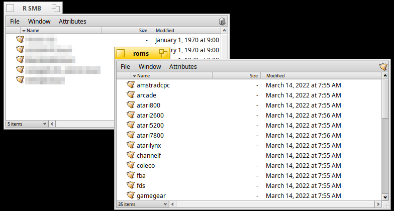
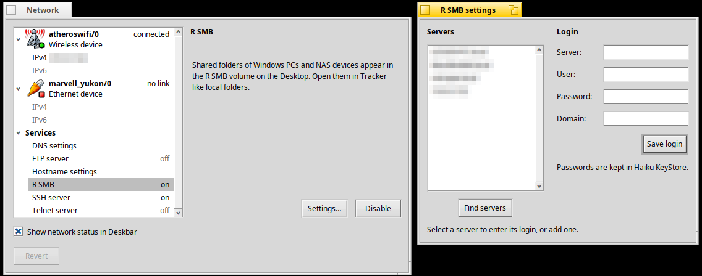

# R SMB

[English](README.md) · [한국어](README.ko.md) · **日本語** · [Italiano](README.it.md) · [Français](README.fr.md)

R SMB を入れると、Haiku から同じネットワークにある Windows PC、Mac、NAS の
共有フォルダーを開けるようになります。





## インストール

1. **ターミナル** を開きます。画面右上の羽根のメニューを押し、
   **アプリケーション > ターミナル** を押します。
2. お使いのコンピューターに合う 3 行をコピーしてターミナルに貼り付け、
   **Enter** を押します。

   **ほとんどの PC (32 ビット版 Haiku):**

   ```sh
   pkgman add-repo https://pkgman.rainygirl.com/x86_gcc2
   pkgman refresh
   pkgman install rsmb_x86
   ```

   **arm64 (RENKU):**

   ```sh
   pkgman add-repo https://pkgman.rainygirl.com/arm64
   pkgman refresh
   pkgman install rsmb
   ```

3. ターミナルに何か聞かれたら **y** を入力して **Enter** を押します。
4. 終わるとデスクトップに **R SMB** のアイコンが現れます。ダブルクリックすると
   ネットワーク上のコンピューターが表示されます。

64 ビット版 Haiku (x86_64) にはまだ対応していません。

## ライセンス

MIT。libsmb2 (GNU LGPL 2.1) と Haiku の一部 (MIT) を含みます。
